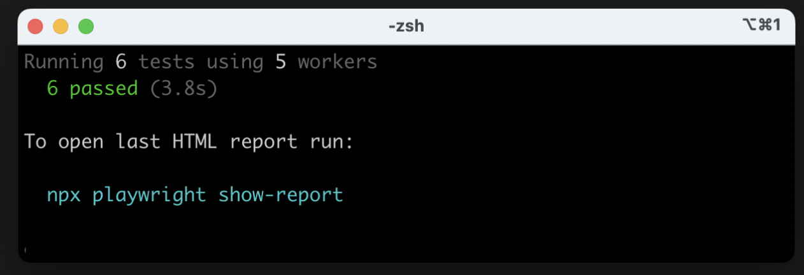
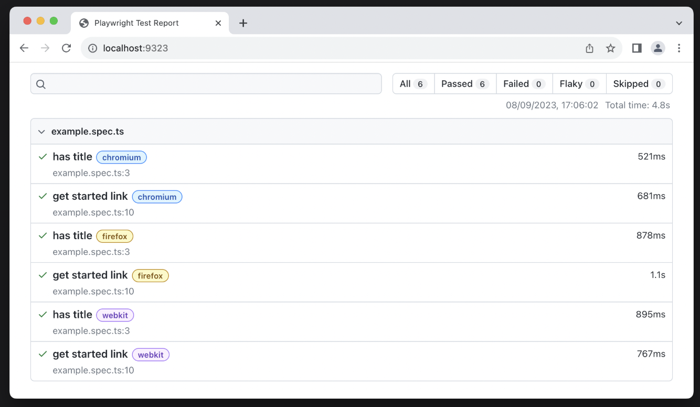
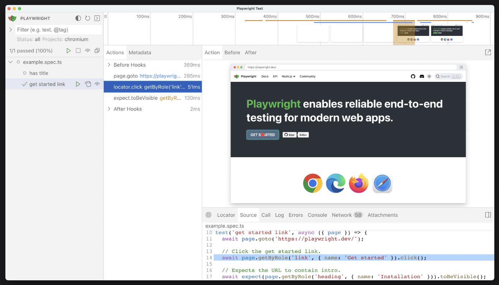

### **Playwright**

**Playwright**는 웹 애플리케이션의 **end-to-end 테스트**를 실행할 수 있게 해주는 도구이다. 브라우저를 실행하여 애플리케이션의 프론트, 백엔드, 데이터베이스까지 모든 부분이 기대에 맞게 작동하는지 확인한다. chromium, safari, firefox 전부 지원

### Playwright 설치 및 초기 설정

- `npm init playwright@latest`

```
playwright.config.ts
package.json
package-lock.json
tests/
  example.spec.ts
tests-examples/
  demo-todo-app.spec.ts
```

### 어플리케이션 테스트

```tsx
import { test, expect } from "@playwright/test";

test.describe("Home Page", () => {
  test.beforeEach(async ({ page }) => {
    await page.goto("http://localhost:3000");
  });

  test("should have correct metadata and elements", async ({ page }) => {
    await expect(
      page.getByRole("heading", {
        name: "Home Page",
      })
    ).toBeVisible();
    await expect(page.getByRole("link", { name: "Form" })).toBeVisible();
  });

  test("should redirect to form page on click", async ({ page }) => {
    await page.getByRole("link", { name: "Form" }).click();

    await expect(page).toHaveTitle("Form");
  });
});

test.describe("Form Page", () => {
  test.beforeEach(async ({ page }) => {
    await page.goto("http://localhost:3000/form");
  });
  
  test("should have empty items list on start", async ({ page }) => {
      // [data-test-id="items-list"] attribute 기반으로 선택
    const itemsList = page.getByTestId("items-list");

    await expect(itemsList).toBeEmpty();
  });

  test("should add item to list", async ({ page }) => {
    const input = page.getByPlaceholder("Enter Item");

    await input.fill("Item 1");

    await page.getByRole("button", { name: "Add" }).click();

    const item = page.getByRole("listitem").first();

    await expect(item).toHaveText("Item 1");
    await expect(input).toBeEmpty();
  });
});

```

### 테스트 실행

- `npx playwright test`
    
    

- `npx playwright show-report`
    
    
    
- `npx playwright test --ui`

    