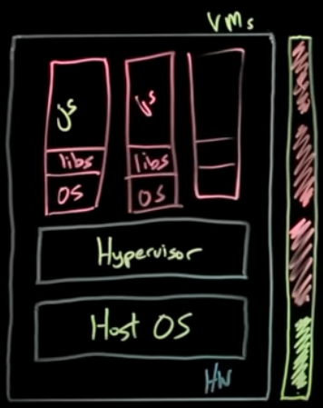
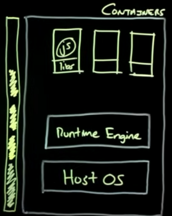

# 도커란 무엇인가?

도커(Docker)는 컨테이너 기반의 가상화 플랫폼으로, 애플리케이션과 그 실행 환경을 컨테이너라는 형태로 패키징하여 배포 및 실행할 수 있도록 도와줍니다. 컨테이너는 필요한 애플리케이션 코드와 라이브러리를 포함하며, 호스트 OS의 커널을 공유하기 때문에 가볍고 빠르게 실행할 수 있습니다. 이는 애플리케이션의 이식성과 효율성을 높이는 데 매우 유용합니다.

---

## 호스트 서버 직접 실행 vs VM vs Container

### 1. 호스트 서버 직접 실행

호스트 서버에서 애플리케이션을 직접 실행하는 방식은 추가적인 가상화 계층 없이 서버의 환경에서 바로 애플리케이션을 실행합니다.

### 장점

- 단순한 설정 및 실행
- 추가 가상화 계층이 없어 리소스 낭비 없음

### 단점

- **환경 격리 부족**
    - 같은 서버 환경을 공유하며, 파일 시스템, 네트워크, 패키지, 라이브러리 등이 겹칠 수 있습니다.
    - 경쟁 조건, 의존성 충돌 등으로 인해 문제가 발생할 가능성이 높습니다.
- **유지보수의 어려움**
    - 여러 애플리케이션의 환경이 섞여 있어 업데이트 및 복구가 복잡합니다.

---

### 2. Virtual Machine (VM)

VM은 하드웨어를 가상화하여 각각의 독립된 운영체제를 실행하는 방식입니다. VM은 하이퍼바이저를 통해 호스트 서버의 리소스를 분리하여 사용할 수 있습니다.

### 장점

- **완벽한 격리**
    - 각 VM은 OS 수준에서 격리되어 있어 보안이 중요한 환경에 적합합니다.
- **이기종 OS 지원**
    - 하나의 호스트 서버에서 여러 종류의 운영체제를 실행할 수 있습니다. 예: 기존 레거시 애플리케이션 실행.

### 단점

- **리소스 사용량이 큼**
    - VM은 각각의 OS를 포함하므로 메모리 및 디스크 사용량이 많습니다.
- **느린 부팅 시간**
    - 새로운 VM을 생성하거나 시작할 때 몇 분의 시간이 걸릴 수 있습니다.

---

### 3. Container (컨테이너)

컨테이너는 애플리케이션과 실행 환경을 패키징하며, 호스트 OS 커널을 공유하여 VM보다 가볍고 빠릅니다. Docker는 대표적인 컨테이너 플랫폼입니다.

### 장점

- **환경 격리**
    - 각 컨테이너는 별도의 환경을 제공하므로 라이브러리 충돌이 없습니다.
- **이식성**
    - 애플리케이션과 실행 환경을 패키징한 Docker 이미지를 어디서나 동일하게 실행할 수 있습니다.
    - 개발, 테스트, 프로덕션 환경에서 일관성을 유지할 수 있으며, 클라우드 간 이동도 간편합니다.
- **배포 효율성**
    - `docker-compose`를 사용하여 다중 컨테이너를 간단히 관리 및 실행할 수 있습니다.
- **유지보수 용이성**
    - 이미지를 사용하여 동일한 상태를 손쉽게 복원할 수 있습니다.
- **확장성**
    - 컨테이너는 수 초 내에 시작되며, 복제를 통해 빠르게 스케일링할 수 있습니다.
    - Docker 명령어를 사용해 로드 밸런싱 및 확장 관리가 가능합니다.
- **리소스 효율성**
    - 경량 구조로 인해 동일한 하드웨어에서 더 많은 컨테이너를 실행할 수 있습니다.

### 단점

- **초기 설정 필요**
    - Dockerfile 작성, 네트워크 및 볼륨 마운트 등의 설정이 필요합니다.
- **리소스 소비**
    - Docker 엔진이 추가로 실행되므로 메모리와 CPU 사용량이 약간 증가할 수 있습니다.

---

## **회사에서 사용 중인 Dockerfile 분석**

```docker
FROM node:20-alpine3.17 AS base

# 메모리 제한 설정
ENV NODE_OPTIONS="--max-old-space-size=3072"

RUN apk --no-cache add tzdata && \
	cp /usr/share/zoneinfo/Asia/Seoul /etc/localtime && \
	echo "Asia/Seoul" > /etc/timezone

FROM base AS deps
WORKDIR /app
COPY package*.json ./
RUN npm install

FROM base AS builder

# build 시점에만 사용되는 변수
# docker build 시에 --build-arg 옵션을 활용하면 오버라이딩 함
ARG NEXT_PUBLIC_DOMAIN_URL
ARG NEXT_PUBLIC_COMMON_API_URL
ARG NEXT_PUBLIC_AI_SKETCH_API_URL
ARG NEXT_PUBLIC_DRAWING_USER_API_URL
ARG NEXT_PUBLIC_DRAWING_SERVICE_ID
ARG NEXT_PUBLIC_AI_PPT_API_URL
ARG NEXT_PUBLIC_AI_PPT_DRAWING_TOOL_URL
ARG NEXT_PUBLIC_AI_ENV
ARG TOKEN_SECRET
ARG MYSQL_DATABASE_URL
ARG MONGO_DATABASE_URL
ARG DRAWING_SERVICE_KEY
ARG REDIS_DATABASE_URL

ENV NEXT_PUBLIC_DOMAIN_URL=${NEXT_PUBLIC_DOMAIN_URL}
ENV NEXT_PUBLIC_COMMON_API_URL=${NEXT_PUBLIC_COMMON_API_URL}
ENV NEXT_PUBLIC_AI_SKETCH_API_URL=${NEXT_PUBLIC_AI_SKETCH_API_URL}
ENV NEXT_PUBLIC_DRAWING_USER_API_URL=${NEXT_PUBLIC_DRAWING_USER_API_URL}
ENV NEXT_PUBLIC_DRAWING_SERVICE_ID=${NEXT_PUBLIC_DRAWING_SERVICE_ID}
ENV NEXT_PUBLIC_AI_PPT_API_URL=${NEXT_PUBLIC_AI_PPT_API_URL}
ENV NEXT_PUBLIC_AI_PPT_DRAWING_TOOL_URL=${NEXT_PUBLIC_AI_PPT_DRAWING_TOOL_URL}
ENV NEXT_PUBLIC_AI_ENV=${NEXT_PUBLIC_AI_ENV}
ENV TOKEN_SECRET=${TOKEN_SECRET}
ENV MYSQL_DATABASE_URL=${MYSQL_DATABASE_URL}
ENV MONGO_DATABASE_URL=${MONGO_DATABASE_URL}
ENV DRAWING_SERVICE_KEY=${DRAWING_SERVICE_KEY}
ENV REDIS_DATABASE_URL=${REDIS_DATABASE_URL}

WORKDIR /app
COPY --from=deps /app/node_modules ./node_modules
COPY . .
# cd school-prisma && npm i && npm run gen && cd ..
# school-prisma/package.json
# "gen": "npm run gen:mysql && npm run gen:mongo"
# "gen:mysql": "npx prisma generate --schema prisma/mysql.schema.prisma"
# "gen:mongo": "npx prisma generate --schema prisma/mongodb.schema.prisma"
RUN npm run db:doc
RUN npm run build

FROM base AS runner
WORKDIR /app

COPY --from=builder /app/public ./public

COPY --from=builder /app/.next/standalone ./
COPY --from=builder /app/.next/static ./.next/static

# 개발 의존성 제거
RUN npm prune --production

USER nextjs

EXPOSE 30202

CMD ["node", "server.js"]
```

- AWS의 ECS(Elastic Container Service)와 ECR(Elastic Container Registry)를 활용하여 컨테이너 기반 애플리케이션 운영 중

## 참고
- https://www.youtube.com/watch?v=0qotVMX-J5s