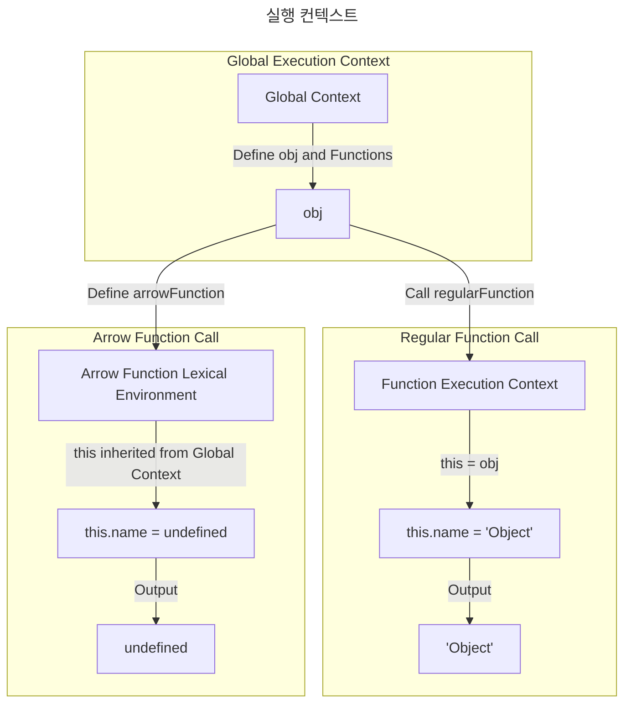

# 함수
> 화살표함수가 아닌 함수는 런타임 시점에 결정되는 this를 그대로 따르고, 
> 
> 화살표함수는 this가 선언되는 시점에 상위 스코프로 결정되어 있어 미리 _this 받아서 쓴다.

**문득 든 의문**
1. 화살표함수는 함수 자체의 바인딩이 없다는게 무슨말이지?
2. 정규함수랑 화살표함수랑 왜 this가 다르지?


## 정규함수와 화살표 함수의 정의

1. 정규함수 : function 키워드를 사용해 정의된 함수/ 함수 선언식과 함수 표현식이 있음
2. 화살표함수 : 화살표 함수는 function 키워드를 사용하지 않고, =>(화살표)로 함수의 본문을 정의(JavaScript의 **ES6(ECMAScript 2015)**에서 도입된 함수의 간단한 표현 방식)

```javascript
// 정규 함수
const add = function (a, b) {
  return a + b;
};

// 화살표 함수
const add = (a, b) => a + b;

console.log(add(2, 3)); // 5

```

### 함수 선언식과 함수 표현식

| **구분**            | **함수 선언식**                          | **함수 표현식**                         |
|---------------------|------------------------------------------|-----------------------------------------|
| **호출 가능 시점**   | 함수 선언 전에 호출 가능 (호이스팅)        | 선언 후에만 호출 가능                   |
| **정의 방법**        | `function 함수명() {}`                  | `const 변수명 = function () {}`        |
| **this 동작**       | 정규 함수의 일반적인 `this` 동작          | 정규 함수의 일반적인 `this` 동작         |

#### 주요 차이점
1. **호출 가능 시점**
    - 함수 선언식은 **호이스팅** 덕분에 선언 전에 호출 가능
    - 함수 표현식은 변수에 함수가 할당된 이후에만 호출 가능

2. **정의 방식**
    - 함수 선언식은 독립적인 함수로 정의
    - 함수 표현식은 함수를 변수에 할당하여 정의

3. **`this` 동작**
    - 두 방식 모두 정규 함수의 일반적인 `this` 바인딩 규칙을 따른다.


____


## 그럼 왜 화살표 함수와 정규 함수의 this가 다르지?

* 화살표 함수 설계 이유:
   * JavaScript에서 정규 함수의 this가 호출 방식에 따라 동적으로 바뀌어 혼란을 초래하는 경우가 많았음
   * 특히, 콜백 함수나 비동기 작업에서 this가 의도치 않게 바뀌는 문제를 해결하기 위해 화살표 함수가 도입됨


* 화살표 함수의 this는 렉시컬 바인딩
    * 화살표 함수는 this를 정의된 위치의 **렉시컬 환경(Lexical Environment)**에서 상속
    * 실행 컨텍스트에서 새로운 this를 설정하지 않으며, 호출 방식에 상관없이 상위 스코프의 this를 사용


---

## 그럼 어떻게 다르지?

### 정규 함수의 this
: 정규 함수는 함수가 호출되는 방식에 따라 this가 동적으로 결정. 

1. 객체 메서드로 호출: this는 해당 객체를 참조.
```javascript
const obj = {
  name: "Object",
  regularFunction: function () {
    console.log(this.name); // `this`는 obj
  },
};

obj.regularFunction(); // 출력: 'Object'

```
2. 독립적으로 호출: this는 (비엄격 모드에서는) 전역 객체를 참조, 엄격 모드에서는 undefined.
```javascript
function regularFunction() {
  console.log(this);
}

// 비엄격 모드
regularFunction(); // 출력: 전역 객체 (window)

// 엄격 모드
"use strict";

function strictRegularFunction() {
  console.log(this);
}

strictRegularFunction(); // 출력: undefined

```
3. call, apply, bind로 호출: this는 명시적으로 설정된 값.
```javascript
function sayHello() {
  console.log(this.name);
}

const obj = { name: "Alice" };
const anotherObj = { name: "Bob" };

sayHello.call(obj); // 출력: 'Alice' (`this`는 obj로 설정)
sayHello.apply(anotherObj); // 출력: 'Bob' (`this`는 anotherObj로 설정)

const boundFunction = sayHello.bind(obj); // `this`를 obj로 고정
boundFunction(); // 출력: 'Alice'

```
4. 생성자로 호출: this는 새로 생성된 객체를 참조.
```javascript
function Person(name) {
   this.name = name;
}

const person = new Person("Alice");
console.log(person.name); // 출력: 'Alice'

```

### 화살표 함수의 this
화살표 함수는 this를 생성하지 않고,
대신, 화살표 함수가 정의된 상위 스코프의 this를 상속받는다.
호출 방식과 관계없이 this는 항상 고정

1. 객체 내부의 화살표 함수
```javascript
const obj = {
    name: 'Object',
    regularFunction: function () {
        console.log(this.name); // `this`는 obj
    },
    arrowFunction: () => {
        console.log(this.name); // `this`는 상위 스코프의 `this` (여기선 전역 객체)
    },
};

obj.regularFunction(); // 출력: 'Object'
obj.arrowFunction(); // 출력: undefined (전역 객체의 name 속성이 없으므로 undefined)
```
정규 함수의 this는 호출 방식에 따라 동적으로 결정
obj.regularFunction()을 호출할 때, 메서드를 호출한 객체(obj)가 호출

화살표 함수는 독자적인 this를 생성하지 않음
대신, 화살표 함수는 정의된 위치에서 **상위 스코프(Lexical Scope)**의 this를 상속받는다.
여기서 arrowFunction이 정의된 상위 스코프는 전역 스코프(window in browsers, global in Node.js)





2. 생성자로 호출할 수 없음
```javascript
const Person = (name) => {
  this.name = name; // 화살표 함수는 this를 가지지 않음
};

const person = new Person("Alice"); // TypeError: Person is not a constructor

```

3. 상위 스코프 유지
```javascript
const outer = {
   name: "Outer",
   inner: {
      name: "Inner",
      regularFunction: function () {
         console.log(this.name); // `this`는 inner
      },
      arrowFunction: () => {
         console.log(this.name); // `this`는 outer
      },
   },
};

outer.inner.regularFunction(); // 출력: 'Inner'
outer.inner.arrowFunction(); // 출력: 'Outer'

```

----


### 정규 함수에서 this가 혼란스러운 이유
정규 함수는 this가 호출 방식에 따라 달라진다.
이 동적인 특성은 JavaScript의 유연성을 높이는 장점이 있지만, 
아래와 같은 상황에서는 문제가 된다.

1. 콜백 함수에서의 문제
```javascript
function Timer() {
  this.seconds = 0;

  setInterval(function () {
    this.seconds++; // 여기서 `this`는 전역 객체(window)를 참조
    console.log(this.seconds); // NaN 또는 오류 발생
  }, 1000);
}

const timer = new Timer();

```
위 코드에서 setInterval의 콜백 함수는 호출 컨텍스트가 전역 환경이기 때문에, 
this가 Timer 인스턴스가 아니라 전역 객체(window 또는 global)를 참조한다.
결과적으로 this.seconds++는 제대로 동작하지 않는다.

-> setInterval의 콜백 함수는 객체의 메서드로 호출되지도 않고, new 키워드를 통해 호출되지도 않으며, 
명시적으로 this를 설정하지도 않기 때문에 함수는 독립적으로 호출된 함수로 간주

### 화살표 함수에서 this를 상속하도록 설계한 이유
화살표 함수는 이러한 혼란을 해결하기 위해 만들어진 것. 
화살표 함수는 **렉시컬 스코프(Lexical Scope)**에서 this를 상속받아 호출 방식에 관계없이 **항상 고정된 this**를 사용

```javascript
function Timer() {
  this.seconds = 0;

  setInterval(() => {
    this.seconds++; // `this`는 Timer 인스턴스를 참조
    console.log(this.seconds); // 1, 2, 3, ...
  }, 1000);
}

const timer = new Timer();

```

여기서 화살표 함수는 상위 스코프(Timer 생성자 함수)의 this를 사용하므로, 항상 Timer 인스턴스를 참조하게 된다.


### 왜 JavaScript 설계자들이 화살표 함수에서 이런 방식을 선택했을까?

```javascript
function Timer() {
  this.seconds = 0;

  // 기존 방식 (bind 사용)
  setInterval(function () {
    this.seconds++;
    console.log(this.seconds);
  }.bind(this), 1000);
}

```

명시적인 this 바인딩의 번거로움 제거할 수 있음.
기존에는 this를 올바르게 유지하려면 .bind() 메서드를 사용해야 했으나, 화살표 함수는 이러한 불편함을 해소