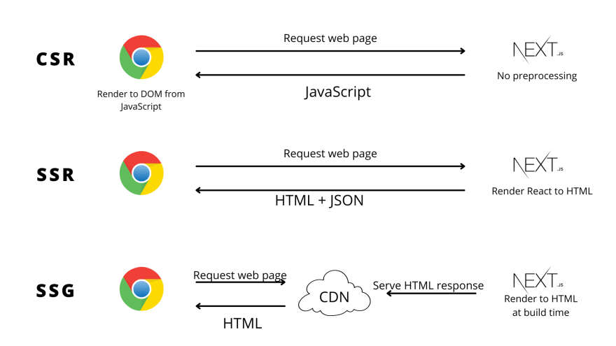
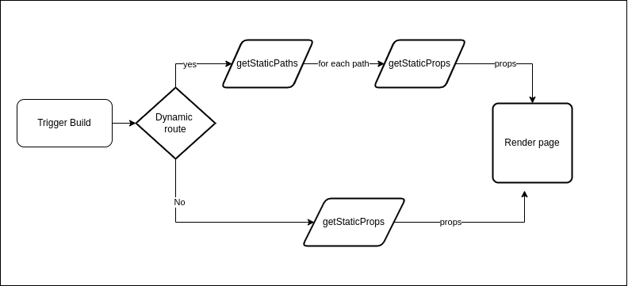

## Week1 comments
> 큰 객체에는 useRef 사용하기
=> 큰 데이터라면 BE에서 관리하는 것이 설계적으로는 옳다고 생각

## 브라우저 렌더링 VS 리액트 렌더링

c.f. SSR, CSR, SSG(HTML 파일을 빌드 시점에 미리 생성), ISR (정적 사이트 생성의 일부를 동적으로 업데이트)
1. 브라우저 렌더링 
: HTML, CSS, JS를 해석하여 화면에 시각적인 결과물을 보여주는 과정


| 단계            | 설명                                                                 |
|-----------------|----------------------------------------------------------------------|
| **HTML 파싱**   | HTML 파일을 해석하여 DOM(Document Object Model)을 생성      |
| **CSS 파싱**    | CSS 파일을 해석하여 CSSOM(CSS Object Model)을 생성           |
| **렌더 트리 생성** | DOM과 CSSOM을 결합하여 화면에 표시할 요소를 정의            |
| **레이아웃 계산** | 각 요소의 크기와 위치를 계산                                 |
| **페인팅**       | 렌더 트리를 기반으로 픽셀 데이터를 생성하여 화면에 그림         |
| **컴포지팅**     | 여러 레이어를 합성하여 최종 화면을 구성                       |


2. 리액트의 렌더링 
: React의 렌더링은 컴포넌트 상태(state)나 props의 변경에 따라 UI를 재구성하는 과정

| 케이스                                      | 설명                                                                                     |
|--------------------------------------------|-----------------------------------------------------------------------------------------|
| **1. props 변경**                          | 부모 컴포넌트가 전달하는 props가 변경되면 자식 컴포넌트가 다시 렌더링               |
| **2. state 변경**                          | 컴포넌트 내부의 state가 변경되면 해당 컴포넌트가 다시 렌더링                     |
| **3. context 변경**                        | Context API로 전달된 값이 변경되면 해당 컨텍스트를 사용하는 컴포넌트들이 렌더링     |
| **4. 부모 컴포넌트의 렌더링**               | 부모 컴포넌트가 렌더링되면 자식 컴포넌트도 기본적으로 다시 렌더링                  |
| **5. forceUpdate 호출**                    | `forceUpdate()`를 호출하면 컴포넌트가 강제로 다시 렌더링                          |
| **6. React.StrictMode 활성화**             | 개발 모드에서 `React.StrictMode`로 감싸진 컴포넌트는 추가로 렌더링 |
| **7. 상태값이 동일해도 렌더링**             | React는 기본적으로 얕은 비교를 사용하므로, 새로운 상태 객체를 설정하면 렌더링       |
| **8. React.memo의 실패**                   | `React.memo`로 컴포넌트를 최적화했더라도 props 비교에 실패하면 다시 렌더링         |
| **9. Redux 또는 상태 관리 라이브러리 사용 시** | Redux, MobX 등의 상태 변경으로 연결된 컴포넌트가 다시 렌더링                      |


c.f. https://www.developerway.com/posts/react-re-renders-guide


## 리액트에서 key ?

> map으로 테이블을 생성할 때, row 안에 selectBox option 값이 변경되어도 DOM이 업데이트 되지 않는 이슈


=> key 가 단순히 index로만 되어 있었다.

### 1. Fiber 알고리즘과 key의 역할
: React의 Fiber 알고리즘은 렌더링 성능 최적화를 위해 재조정(Reconciliation) 과정을 사용하는데, 
이 과정에서 key는 컴포넌트 식별자의 역할을 함 (변경 추적을 가능하게 함)


### 2. sibling 속성의 역할
- React는 컴포넌트 트리를 Fiber 노드로 변환하고, 각 노드는 child, sibling, return 속성을 사용하여 컴포넌트 구조를 연결
- sibling 속성은 같은 부모를 공유하는 형제 컴포넌트를 연결
- 이를 통해 React는 형제 노드 간의 순서를 유지하고, 필요할 때 순서에 따라 다음 노드로 이동

```
function App() {
  return (
    <div>
      <h1>Title</h1>
      <p>Paragraph</p>
    </div>
  );
}

```

// Fiber 구조
```
<div>
  ├── child: <h1>
  └── sibling: <p>
```

// React의 Fiber 구조는 React Fiber는 트리 구조를 관리하기 위해 Linked List처럼 동작하도록 설계
- Fiber 구조는 DFS(깊이 우선 방식) 방식으로 트리를 순회, child → sibling → 부모(return)를 통해 효율적으로 순회
- React의 Concurrent Mode는 작업을 중단 후 나중에 이어서 처리하게 되는데, 링크드 리스트 구조 덕분에 현재 진행 중인 위치(child/sibling)만 기억하면 중단 이후 재개가 간단
```
<div> --child--> <h1> --sibling--> <p>
  ↑                     ↑
  |                     |
  return               return
  |                     |
 null                <div>
```


### 3. 재조정 단계(Reconciliation)에서 sibling의 역할
- React의 Reconciliation 과정에서 Fiber 알고리즘은 새로운 Virtual DOM과 기존 Fiber 트리를 비교하여 변경 사항을 반영
- 이 과정에서 sibling은 효율적인 탐색을 지원

c.f. Reconciliation은 React가 이전 Virtual DOM 트리(current)와 새 Virtual DOM 트리(workInProgress)를 비교하여 변경된 부분만 업데이트하는 과정
- child, sibling, return 속성 중, sibling은 형제 노드 간의 관계를 유지하며 순회와 비교를 지원 -> 순서 결정!


```
function List() {
  return (
    <ul>
      <li>Item 1</li>
      <li>Item 2</li>
      <li>Item 3</li>
    </ul>
  );
}
```

```
<ul>
  ├── child: <li>Item 1</li>
  ├── sibling: <li>Item 2</li>
  └── sibling: <li>Item 3</li>
```
-> 재조정 단계에서 각 노드를 순서대로 비교하며, 변경되지 않은 노드는 그대로 둔다.

### 4. sibling과 key의 관계
- 리스트 아이템에 key를 설정하지 않거나 잘못된 key를 사용하면, React는 sibling을 잘못 관리할 가능성이 있음
- React에서 **key**는 Reconciliation 과정에서 노드를 식별하는 데 사용되기 때문
: Reconciliation에서 React는 두 Fiber 트리 (current와 workInProgress)를 비교하여, 
1) 유지: 동일한 key를 가진 노드는 재사용
2) 추가: 이전 트리에 없지만 새 트리에 있는 key는 새로 생성
3) 삭제: 이전 트리에 있지만 새 트리에 없는 key는 제거


```
const items = ["A", "B", "C"];

function App() {
  return items.map((item, index) => <div key={index}>{item}</div>);
}
```


```
// 초기 상태
<div>
  ├── child: <div key=0>A</div>
  ├── sibling: <div key=1>B</div>
  └── sibling: <div key=2>C</div>

```


// items 배열이 ["C", "A", "B"]로 변경:
1. React는 이전 트리(current)와 새 배열(workInProgress)을 비교
2. index 기반 key를 사용하므로, 새 배열의 첫 번째 항목 "C"를 **key=0**에 매핑
3. React는 `<div key=0>`을 재사용하여 "C"를 렌더링.
4. 이어서 "A"를 **key=1**에 매핑, "B"를 **key=2**에 매핑.

```
// 결과적으로 매핑이 잘못됨
<div>
  ├── <div key=0>C</div>  // 기존 A -> C로 잘못 매핑
  ├── <div key=1>A</div>  // 기존 B -> A로 잘못 매핑
  └── <div key=2>B</div>  // 기존 C -> B로 잘못 매핑
```

// 형제 노드(sibling) 연결 문제
- React는 key를 기반으로 각 노드의 sibling을 연결하는데, key가 잘못 설정되면:
React는 이전의 형제 노드 관계를 그대로 유지하려 시도.

-> 잘못된 key 매핑으로 인해 sibling이 잘못 연결:
예: `<div key=0>`가 이전에는 "A"였지만, 지금은 "C"로 재사용.
React는 `<div key=1>`와 `<div key=2>`의 연결 관계도 그대로 유지.

-> 결과적으로:
화면상의 순서와 Fiber 트리의 sibling 연결이 어긋남.
React는 DOM을 잘못 업데이트하거나 불필요한 업데이트를 수행.


### React는 sibling을 활용하여:
- 형제 노드를 순차적으로 탐색하고,
- 변경 사항만 추적하며,
- DOM 업데이트를 최소화하여 성능을 최적화


## 5. 올바른 key 설정방법
```
const items = [
  { id: 1, text: "A" },
  { id: 2, text: "B" },
  { id: 3, text: "C" },
];

function App() {
  return items.map((item) => <div key={item.id}>{item.text}</div>);
}

```
- React는 id를 기반으로 항목을 정확히 매핑.
- 배열 순서가 바뀌거나 항목이 추가/삭제되어도 sibling이 올바르게 재구성됨 / 변경된 부분만 업데이트