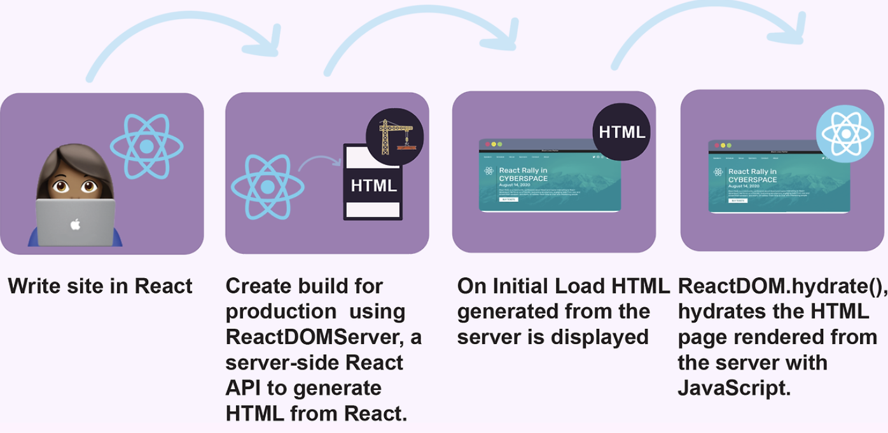
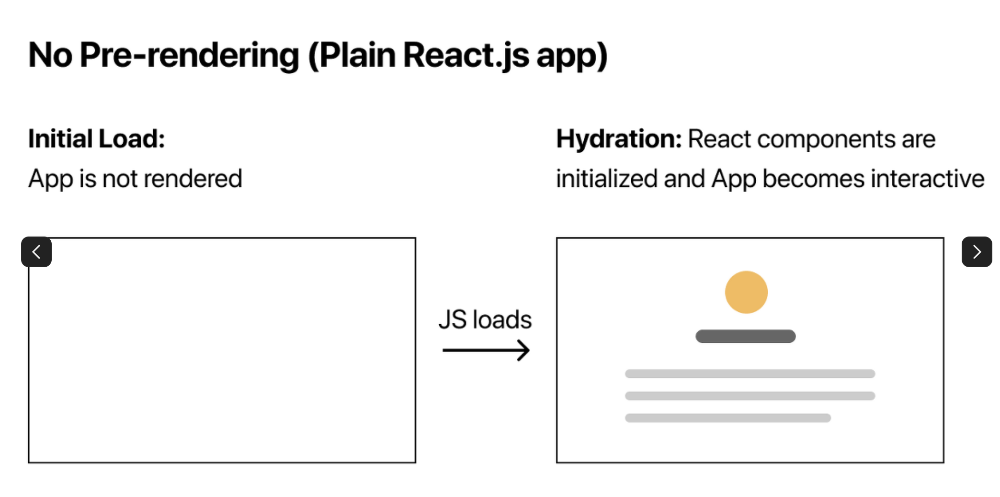
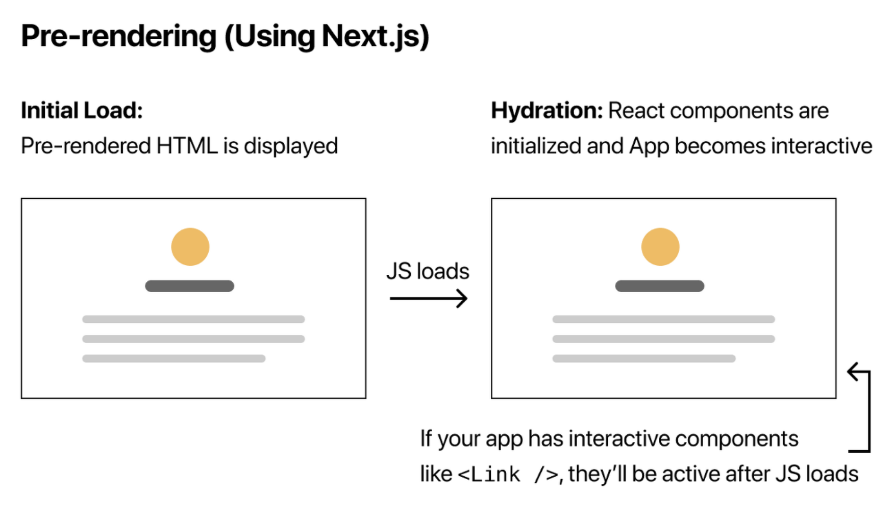
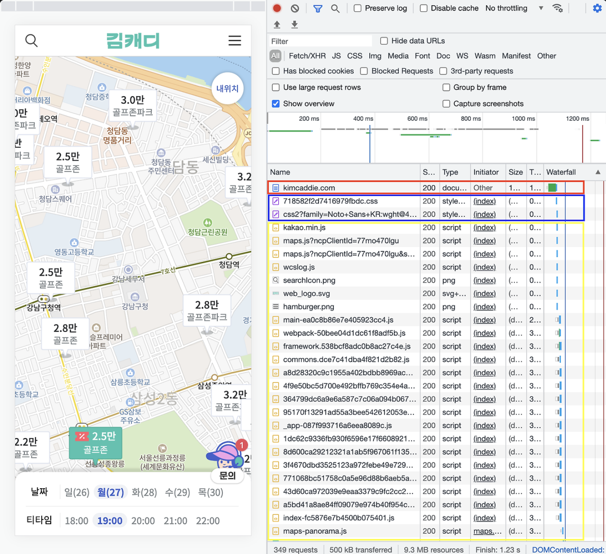
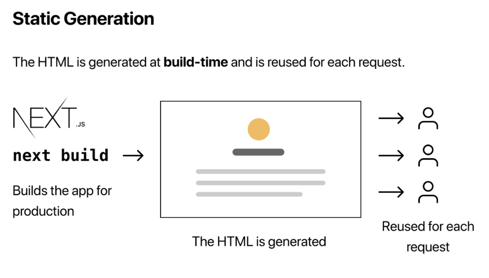
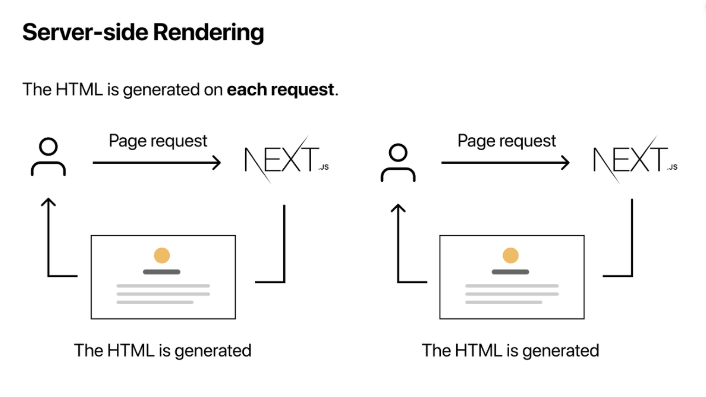

## SSR과 SPA가 서로 배타적인 개념이 아니라, 서로 보완적으로 동작한다.
: Next가 React 기반 프레임워크로 작동하기 때문

1. 서버에서의 SSR (첫 번째 렌더링)
- 사용자가 페이지를 요청하면, Next.js 서버는 해당 요청을 처리하여 HTML을 생성하고 클라이언트(브라우저)로 반환
- 이 HTML은 이미 React 컴포넌트로 렌더링된 상태로, 데이터와 콘텐츠가 포함되어 있으므로 빠르게 화면을 표시 가능
- React의 클라이언트 측 자바스크립트가 아직 실행되지 않았기 때문에 단순한 HTML로 동작
(서버에서 `getServerSideProps`를 실행해 데이터를 가져오고, 해당 데이터를 포함한 HTML을 생성해 클라이언트로 반환)




2. 클라이언트에서의 Hydration
- HTML이 클라이언트에 로드되면, React의 자바스크립트 번들이 로드되어 "Hydration" 과정을 시작
- 서버에서 넘어온 HTML과 React 컴포넌트가 결합하는 과정
- 서버는 HTML파일을 클라이언트에 전송한 후, 번들링된 JS코드를 클라이언트에 전송한다. 이 번들링된 JS 코드들이 HTML DOM위에서 rendering 되어 자기 위키에 렌더링된다.

** 사실 next에 종속된 개념이 아니라, ReactDOM에 존재하는 모듈이다. 
리액트 18버전에서는 hydrateRoot로 대체되었다.

https://18.react.dev/reference/react-dom/client/hydrateRoot 







(1) 빨간 박스: HTML이 받아지고
(2) 파란 박스: CSS 파일이 받아지고
(3) 노란 박스: 번들링된 JS 파일이 받아진다.

3. SPA로 전환
- Hydration이 완료된 후, React는 클라이언트 측에서 전체 애플리케이션을 제어
- 이제부터는 페이지 전환이나 사용자와의 상호작용이 발생하면 서버로 요청을 보내는 대신, 클라이언트에서 모든 작업이 처리
- e.x. 다른 페이지로 이동할 때 브라우저 전체를 새로고침하지 않고 React의 라우터를 통해 클라이언트에서만 업데이트


## SSG란? (Static Site Generation)
: 정적 사이트 생성, build 타임 때 React 컴포넌트를 HTML 렌더링 해 놓는 것

** 리액트 앱은 클라이언트 측에서 렌더링 되기 때문에 
사용자의 브라우저는 먼저 자바스크립트 번들을 다운로드 한 다음 사용자가 컨텐츠를 보기도 전에 다운로드한 자바스크립트 번들을 실행 => 느리다

- SSG의 정적(Static)은 SSR 처럼 전체 프로세스가 각 사용자 요청에 수행되는 것이 아닌 빌드 시간에 수행되어, SSG가 서버 사이드 렌더링보다 훨씬 더 빠르다.

- SSG는 빌드 시 리액트 앱에서 HTML 페이지를 만들기 때문에 모든 요청에 대해 HTML 페이지를 작성할 필요가 없으며, 클라이언트 사이드의 브라우저에서도 HTML 페이지를 작성할 필요가 없음

#### 이점
- SEO: 검색 엔진 최적화 (크롤링)
- 속도
- CDN을 사용한 캐싱: 모든 요청은 서버가 페이지를 렌더링할 때까지 기다릴 필요가 없으며 CDN에서 페이지를 수신하기만 하면 되기 때문에 계산 리소스와 비용을 절약
c.f. Content Delivery Network : 서버를 분산시켜 캐싱해두고 사용자의 컨텐츠 요청이 들어오면 사용자와 가장 가까운 위치에 존재하는 서버로 매핑시켜 요청된 콘텐츠의 캐싱된 내용을 내어주는 방식


#### Next에서의 사용
: pages 디렉토리에 새 파일 작성하면 된다!


c.f. getStaticProps : Next.js는 빌드 타임 때 해당 데이터를 미리 fetch 한다는 것을 인식하고 실행

-> Next.js는 빌드 시 실행할 페이지에서 내보낸 getStaticProps 메서드를 찾음!

```javascript
export async function getStaticProps() {
  const res = await fetch('https://api.example.com/data');
  const data = await res.json();
  return { props: { data } };
}

```





| **특징**              | **SSR**                                         | **SSG**                                         |
|-----------------------|------------------------------------------------|------------------------------------------------|
| **HTML 생성 시점**     | 요청 시점 (서버에서 동적으로 생성)              | 빌드 시점 (정적으로 미리 생성)                 |
| **데이터 최신성**      | 항상 최신 데이터를 제공                         | 빌드 이후 데이터 변경 시 반영되지 않음 (ISR 가능) |
| **응답 속도**          | 느릴 수 있음 (요청마다 HTML 생성)               | 매우 빠름 (정적 파일 제공)                     |
| **서버 부하**          | 트래픽 증가 시 서버 부하 증가                    | 서버 부하 적음                                 |
| **SEO**               | 적합                                           | 적합                                           |
| **적합한 사용 사례**   | 최신 데이터가 필요한 페이지 (예: 대시보드)       | 정적인 콘텐츠 페이지 (예: 블로그, 문서)         |


### ISR
: 빌드 시점에 페이지를 렌더링 한 후, 설정한 시간 마다 페이지를 새로 렌더링 하는 방식. ssg의 일종으로, 일정 시간마다 데이터를 최신으로 유지할수 있는 장점이 추가된 방식

```javascript
export default function ISR({ data }: SSRPageProps) {
  return (
    <main>
      <div>{data}<div>
    </main>
  );
}

export const getStaticProps: GetStaticProps = async () => {
  const res = await axios.get('https://worldtimeapi.org/api/ip');

  return {
    props: { dateTime: res.data.datetime },
    revalidate: 20,
  };
};
```


## getServerSideProps
: Next.js에서 SSR을 구현하는 공식적인 데이터 패칭 메서드

- 서버에서만 실행
- pages 디렉토리에 있는 파일에서만 사용할 수 있음
- Next.js는 getServerSideProps를 자동으로 최적화하여 필요한 데이터만 가져오고, 요청당 1회 실행
- SEO에 적합


## getInitialProps
: Next.js의 초창기부터 제공된 데이터 패칭 메서드, 클라이언트와 서버 모두 실행될 수 있음

```javascript
function Page({ data }) {
  return (
    <div>
      <h1>Data from getInitialProps</h1>
      <p>{data.message}</p>
    </div>
  );
}

Page.getInitialProps = async (context) => {
  const res = await fetch('https://api.example.com/data');
  const data = await res.json();

  return { data };
};

export default Page;

```

