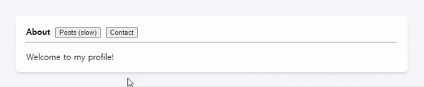
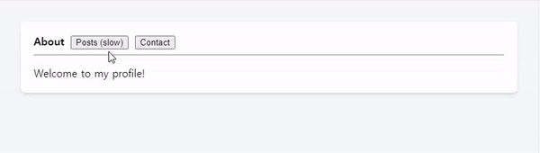

# 리액트의 상태 관리와 동시성 렌더링(Concurrent Rendering)

## 동시성 렌더링(Concurrent Rendering)이란?

- 비동시성 렌더링(Non-Concurrent Rendering) 기존 렌더링 : React는 상태가 바뀌면 즉시 모든 렌더링 작업을 한 번에 처리.
→ 화면이 큰 경우 작업이 오래 걸려 **사용자 인터랙션(UI 응답)**이 느려질 수 있음.

c.f. 반응성 중단(responsive block)
JS는 싱글 스레드이기 때문에, 무거운 작업을 실행하는 동안 리액트의 모든 상호작용이 정지되는데, 
그 동안 리액트는 사용자의 입력에 응답하지 않으며 사용자는 불쾌한 경험을 하게 된다.
이 현상을 반응성 중단이라고 한다.

- 동시성 렌더링:
**동시성 렌더링은 무거운 작업을 수행하면서도 여전히 반응성을 유지할 수 있는 기능**
React가 렌더링 작업을 쪼개고, 우선순위에 따라 중요한 작업을 먼저 처리.
→ 화면 업데이트는 빠르게, 덜 중요한 작업은 나중에 처리.


## 예시로 필요성 이해하기

App.js에서 <TabButton> 중 클릭된 버튼에 해당하는 내용을 화면에 보여주는 리액트 코드가 있다.

About, Posts(slow), Contact 버튼 클릭시 버튼이 볼드처리되며, 각 버튼에 할당된 내용이 하단에 렌더링된다.
하지만 Posts(slow) 클릭시 내부에 500개의 컴포넌트를 렌더링하는 매우 느린 SlowPost 컴포넌트를 렌더링한다.

Posts(slow) 버튼을 클릭하면 어떻게될까?
SlowPost 컴포넌트가 모두 렌더링되는 몇초동안, 사용자의 탭버튼 클릭 등을 포함해 모든 상호작용이 정지한다.



반응성 중단이 일어난 동안, 탭 버튼 컴포넌트는 Contact에 마우스를 올려도 hover UI를 보여주지 않는 문제가 있다.
또, Contact 버튼을 연타할 동안 아무 반응이 없다가 Posts렌더링이 끝나야 Contact 버튼 클릭이 작동된다는 문제를 가지고 있다.


## 동시성 렌더링의 주요 목표
- UI의 응답성 유지: 버튼 클릭이나 입력 필드와 같은 사용자 상호작용을 즉시 처리.
- 우선순위 관리: 덜 중요한 작업(배경 작업 등)은 나중에 처리.
- 렌더링 병목 완화: 렌더링 작업이 많아도 중단/재개하며 효율적으로 처리.


## 상태 관리와 동시성 렌더링의 연관
> 리액트의 새로운 상태 관리 메커니즘이 동시성 렌더링(Concurrent Rendering)과 어떻게 연관되어 있는가?

1. React 상태 관리 라이브러리의 역할
   리액트 상태 관리 라이브러리는 주로 다음과 같은 목적으로 사용됨:
   * 상태 중앙화: 상태를 전역으로 관리

2. 상태 관리와 렌더링은 기본적으로 연관되어 있다:
  * 리렌더링 트리거:
상태 변경 → 리렌더링 트리거: React 컴포넌트는 상태 변경을 감지하면, 해당 컴포넌트와 그 하위 트리를 다시 렌더링

  * 빈번한 상태 업데이트 문제점: 상태 변경의 빈도와 규모
  * 대규모 상태 변경: 복잡한 애플리케이션에서 상태 변경이 자주 발생하면, 컴포넌트 렌더링 비용이 크게 증가
  * 렌더링 병목: 상태 업데이트가 발생하면 React는 해당 변경을 처리하는 동안 UI 업데이트를 블로킹(blocking)
    -> 이는 사용자 경험을 저하


## React18에서의 동시성 렌더링 처리 도입
React 18 이전에는 상태 변경 시 렌더링 작업이 **동기적(Synchronous)**으로 실행되었음:
- 즉시 처리: 상태가 변경되면 React는 모든 렌더링 작업을 즉시 완료하려고 시도.
- 작업 중단 불가능: 렌더링 작업이 실행되는 동안 다른 작업(예: 사용자 입력) 처리 불가능.
- 우선순위 없음: 모든 상태 변경이 동일한 우선순위로 처리.


#### 동시성 렌더링 설계

(1) 작업 분리
- 렌더링 작업을 작은 단위로 나누어 필요한 작업만 우선 처리.
- 덜 중요한 작업(예: 배경 데이터 로딩)은 나중에 처리.

(2) 작업 중단과 재개
- 렌더링 작업이 오래 걸릴 경우 중단(suspend)하고, 더 중요한 작업(예: 사용자 입력)을 우선 처리.
- 예: startTransition을 사용하면, 저우선순위 상태 업데이트는 백그라운드에서 처리.

(3) 우선순위 관리
- React는 상태 업데이트에 **우선순위(priority)**를 부여.
- 고우선순위: 사용자와의 상호작용(버튼 클릭, 입력).
- 저우선순위: 대규모 데이터 필터링, 애니메이션.


## 어떻게 React18은 동시성 렌더링을 처리하였는가?

### 비동기 상태 관리 : Suspense
**Suspense**는 React 컴포넌트 렌더링 중 **비동기 작업(예: 데이터 로딩)**이 필요한 경우, 작업이 완료될 때까지 렌더링을 지연시키고, 대체 UI(예: 로딩 스피너)를 보여주는 역할

```javascript
import React, { Suspense } from "react";

// 비동기 데이터 로딩 함수
const fetchData = async () => {
  return new Promise((resolve) => {
    setTimeout(() => resolve("Data Loaded!"), 2000);
  });
};

// Lazy-loading 컴포넌트
const DataComponent = React.lazy(() => fetchData().then((data) => () => <div>{data}</div>));

function App() {
  return (
    <Suspense fallback={<p>Loading...</p>}>
      <DataComponent />
    </Suspense>
  );
}
```


### 상태 업데이트의 우선순위 처리 : startTransition
 **startTransition**은 상태 업데이트를 저우선순위 작업으로 처리하도록 지정할 수 있는 React의 기본 Hook.
중요한 작업(예: 사용자 입력, 클릭 이벤트)은 즉시 처리하고, 덜 중요한 작업(예: 렌더링 업데이트)은 나중에 처리하도록 React가 관리

setter를 담고있는 함수를 startTransition으로 감싸주기만 하면 된다.
(startTransition은 setter 함수(상태의 변경)의 반영을 지연시키는 효과)

```javascript
import React, { useState, useTransition } from "react";

function App() {
  const [input, setInput] = useState("");
  const [filteredItems, setFilteredItems] = useState([]);
  const [isPending, startTransition] = useTransition();

  const items = Array.from({ length: 10000 }, (_, i) => `Item ${i}`);

  const handleInputChange = (e) => {
    const value = e.target.value;
    setInput(value);

    // 저우선순위 작업으로 필터링 처리
    startTransition(() => {
      const filtered = items.filter((item) => item.includes(value));
      setFilteredItems(filtered);
    });
  };

  return (
    <div>
      <input value={input} onChange={handleInputChange} />
      {isPending ? <p>Filtering...</p> : <ul>{filteredItems.map((item) => <li key={item}>{item}</li>)}</ul>}
    </div>
  );
}
```


### 지연된 상태 만들기 : useDeferredValue

startTransition은 setter 함수에만 지연효과를 준 것임에 반해,
**useDeferredValue**는 값의 변경에 따라 발생하는 렌더링 작업만 지연시킵니다.

useDeferredValue는  **지연된 값(deferredValue)**을 만들어서 원래 값의 변경을 추적하면서도, 렌더링을 나중에 수행하도록 설정한다.
주로 부모 컴포넌트에서 자식 컴포넌트로 값(props)을 전달할 때 유용하다.



```javascript
import { useState, useDeferredValue } from "react";
import AboutTab from "./AboutTab.js";
import PostsTab from "./PostsTab.js";
import ContactTab from "./ContactTab.js";

export default function TabContainer() {
  const [tab, setTab] = useState("about");
  const deferredTab = useDeferredValue(tab); // 지연된 값 생성

  function selectTab(nextTab) {
    setTab(nextTab); // 고우선순위 작업: 상태 변경
  }

  return (
    <>
      <button onClick={() => selectTab("about")}>About</button>
      <button onClick={() => selectTab("posts")}>Posts (slow)</button>
      <button onClick={() => selectTab("contact")}>Contact</button>
      <hr />
      {deferredTab === "about" && <AboutTab />}
      {deferredTab === "posts" && <PostsTab />}
      {deferredTab === "contact" && <ContactTab />}
    </>
  );
}
```

=> 특정 값과 관련된 작업만 지연하므로 렌더링 범위가 더 좁고 정밀