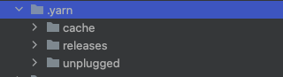
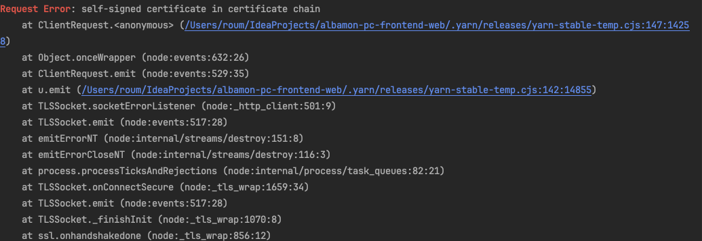
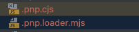
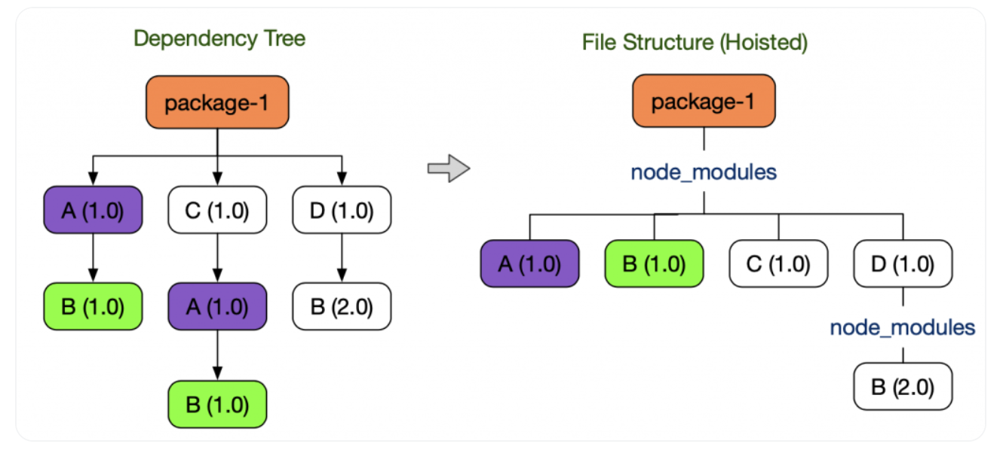
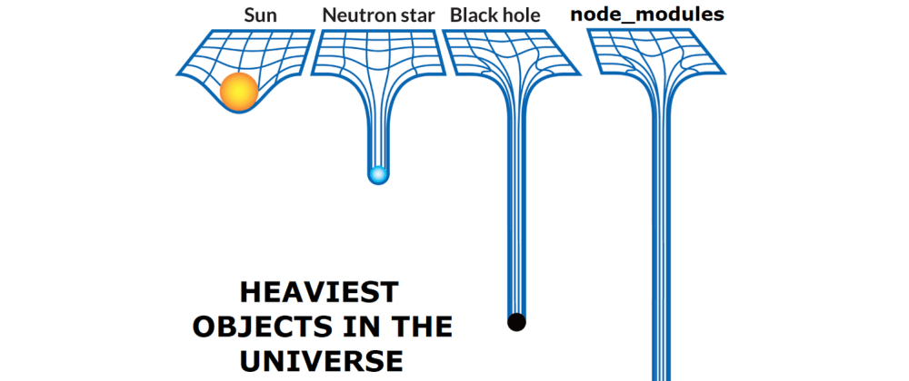
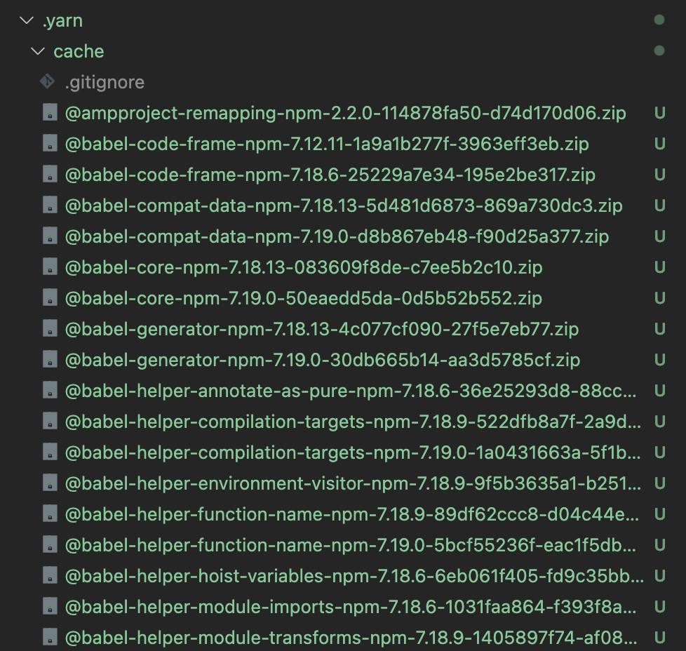

[PC] yarn classic > yarn berry migration

1) 마이그레이션 진행하기
1. Yarn version 변경
   yarn set version berry

yarn 버전을 업데이트하면, 

.yarn 폴더와 .yarnrc.yml 파일이 생성된다.

c.f. .yarnrc.yml 이란?
: yarn berry 이후 버전에서 사용되는 설정 파일로, yaml 형식으로 쓰여있다.

성공 예시

c.f. 인증 에러가 나오면 guest wifi 로 접속해서 다시 시도

2. 설치된 의존성 마이그레이션 하기

버전을 변경하면서 생긴 .yarnrc.yml 파일에 nodeLinker: node-modules 옵션을 추가한다.

yarn install 명령어 실행한다.

yarnPath: .yarn/releases/yarn-4.6.0.cjs

nodeLinker: node-modules // 이 부분 추가한다

기존에 생성된 yarn.lock 파일을 berry 버전으로 마이그레이션 하는 과정이다.

3. PnP 적용하기

마이그레이션을 위해 임시로 설정하였던 nodeLinker 옵션을 제거하고 yarn install을 수행하면,

마이그레이션된 .lock 파일을 읽어 PnP 버전으로 의존성을 설치한다.

yarnPath: .yarn/releases/yarn-4.6.0.cjs

PnP 파일들이 생성된 모습

4. (VS code IDE 사용자의 경우)

ZipFS - a zip file system 설치

타입스크립트 툴킷 설치 필요: yarn dlx @yarn pkg/sdks vscode

issue tracking
1. 유령 의존성(phantom dependency)

: yarn classic 에서 중복 설치되는 Node_modules을 아끼기 위해 Hositing 기법을 사용하는데,

이 과정에서 직접 의존하고 있지 않은 라이브러리를 require() 할 수 있는 현상이 발생한다. 이를 유령 의존성이라고 한다.

(1) lodash

yarn info lodash

명령어를 입력하여 설치 정보를 확인할 수 있다. lodash가 미설치되었는지 확인 후 설치한다.

yarn add lodash
yarn add @types/lodash -D
yarn install

(2) lodash-es

yarn add lodash-es
yarn install

2. Peer Dependency

   : peerDependencies란 실제로 패키지에서 require나 import 하지는 않지만, 특정 라이브러리나 툴에 호환성을 필요로 할 경우에 명시하는 dependencies

(3) focus-trap-react/ prop-types

yarn add prop-types
yarn install

(4) ckeditor/ckeditor5-core

yarn add @ckeditor/ckeditor5-core
yarn install

2) 성능 비교 결과

(1) 의존성 설치 속도(Cold Start vs Cached Start)

(2) 빌드 성능

(3) 디스크 사용량

3) 추가 알아보기 (Optional)
   npm, yarn, yarn-berry, pnpm 은 무엇이 다른가요?
   npm(Node Package Manager)
   npm은 Node.js 설치 시 기본으로 제공되어 범용적으로 사용되고 있는 패키지 매니저이다. 

비효율적인 의존성 검색
: npm은 파일 시스템을 이용하여 의존성을 관리한다. 이 과정에서 node_modules를 이용하는데, 의존성 검색이 비효율적으로 동작한다.
특정 npm 패키지를 찾기 위해 `require.resolve.paths() ` 함수를 이용하여 계속 상위 디렉토리의 node_modules폴더를 탐색한다.
패키지를 바로 찾지 못할수록 느린 I/O 호출이 반복되고, 중간에 실패하기도 한다.

무거운 node_modules
: npm에서 구성하는 node_modules는 디렉토리 구조가 복잡하고, 많은 공간을 차지한다.
깊은 트리 구조에서 의존성이 잘 설치되어 있는지 확인하려면, 많은 수의 I/O 호출이 필요하다. 

yarn-berry
Zero Install
: 말 그대로 설치를 하지 않고 이용하는 방식을 말한다. 기존 node_modules에서 모든 dependancy를 install 하는 과정은 많은 시간을 필요로 한다. 
Zero install은 install에 걸리는 시간을 없앨 수 있기 때문에 CI 실행시간 및  배포 시간 단축이 가능하다. 
PnP(Plug  And Play)
: yarn berry가 Zero Install을 위하여 지원하는 기능으로, .yarnrc.yml 파일에 yarn config 관련 내용을 설정할 수 있다. 
dependency module을 관리하는 방식인 nodeLinker는 pnp, pnpm, node_modules 중 선택이 가능하다.

// .yarnrc.yml
nodeLinker: "pnp" // pnp(default), pnpm, node_modules 중 설정 가능.

Zip Archive File
: PnP 모드로 설정하면, node_modules로 dependency 가 설치되지 않고, 대신 필요한 라이브러리 모듈이 .yarn/.cache 디렉토리에 zip 아카이브 파일로 관리하게 된다. 
각 zip 모듈의 의존성 트리 정보들은 프로젝트 루트의 .pnp.cjs 파일로 관리하게 된다.
유령 의존성 문제를 해소할 수 있다.

strict mode
: 기존의 프로젝트에서 yarn-berry의 pnp를 이용하면, dependency error 가 발생한다. 
pnp로 모듈을 사용하기 위해서는 pnp 방식에 맞게 strict한 방식으로 의존성 트리가 관리가 되어야 한다. 

