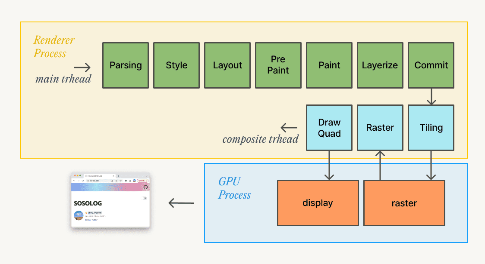
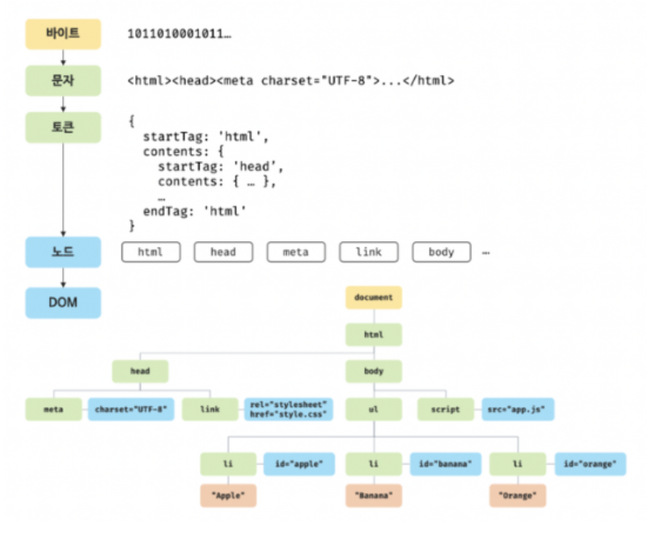
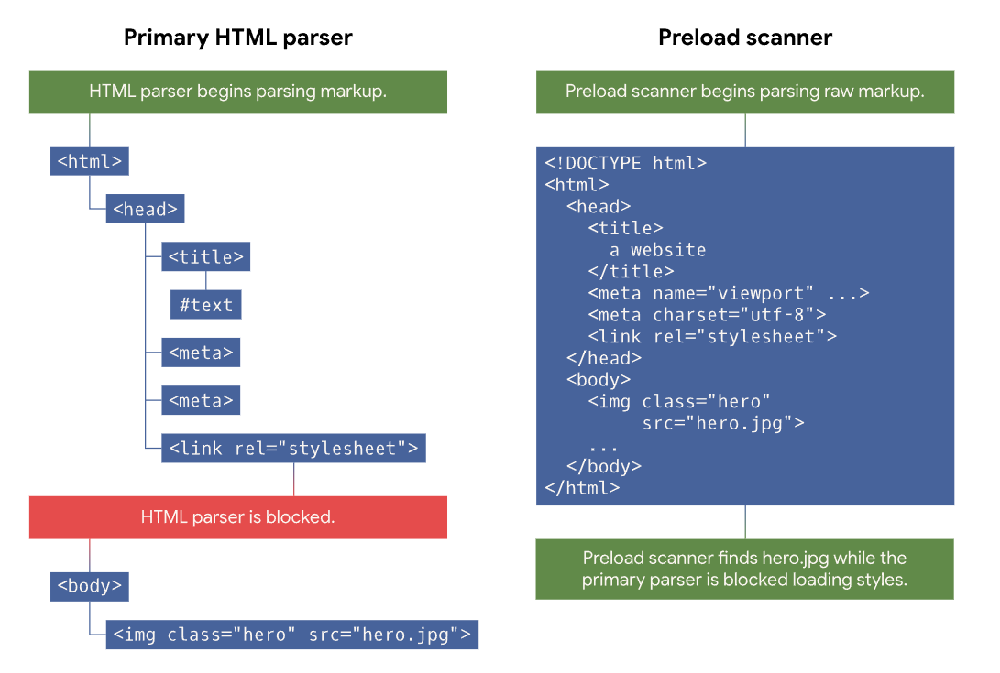
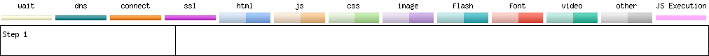

# Browser pre-load scanner

# 브라우저 렌더링

> dom 파싱 -> cssom 생성 -> 렌더트리 생성 -> DOM API사용해 랜더 트리 변경 리플로우 -> 리페인트

렌더러 프로세스
렌더러 프로세스는 웹 콘텐츠를 처리하고 탭 내부에서 발생하는 모든 작업을 담당합니다. 렌더러 프로세스의 메인 스레드가 브라우저로 전송된 대부분의 코드를 처리합니다. 렌더러 프로세스의 주요 역할은 HTML과 CSS, JavaScript를 사용자와 상호작용을 할 수 있는 웹 페이지로 변환하는 것입니다.

Main스레드
Parsing, Style, Layout , PrePaint , Paint , Layerize , Commit

Composite스레드
Tiling , Raster , DrawQuard

Raster 스레드
조금 생소한 용어들이 많이 나오지만 사실 이해하기 엄청나게 어려운 개념이 아니기 때문에 천천히 따라가봅시다.

### 🎨 Part 1 : Main Thread
js 실행, 레이어 생성 등

1. Parsing
   HTML 데이터를 수신하기 시작하면 렌더러 프로세스의 메인 스레드는 문자열(HTML)을 파싱해서 DOM(document object model)으로 변환합니다.



서버로부터 받은 문서를 바이트로 응답 받습니다.
응답받은 데이터를 문자열로 변환합니다.
문바열로 변환된 HTML 문서를 문법적 의미를 갖는 토큰들로 분해합니다.
각 토큰들을 객체로 변환하여 노드를 생성합니다.
노드들을 트리 자료구조로 구성한 DOM(Doucment Object Model)이 완성됩니다.

### CSSOM 생성
HTML과 동일한 파싱 과정(바이트 -> 문자 -> 토큰 -> 노드 -> CSSOM)을 거치며 해석하여 CSSOM(CSS Object Model)을 생성합니다. DOM Tree파싱 이후 브라우저는 CSS를 파싱해서 세 가지 단계로 각 DOM노드의 스타일을 계산합니다.


### pre-load scanner 과정이 여기서 실행됨

웹 개발자가 웹 페이지 속도를 개선하기 위해서 가장 먼저 알아야할 것은, 웹 페이지 로딩 속도 개선을 위한 테크닉이나 팁이 아닌 바로 브라우저의 동작 원리다.
우리가 최적화 하려고 노력하는 것 만큼, 브라우저도 웹페이지를 로딩할 때 최적화 하려고 더 노력한다.
하지만 우리의 이런 최적화 노력이 의도치 않게 브라우저의 최적화 노력을 방해할 수도 있다.


## Pre-load Scanner 란?



모든 브라우저는 파일을 토큰화 하고 객체 모델로 처리하는 HTML 파서를 기본적으로 가지고 있습니다.
이 모든 작업은 이 파서가 <link /> 또는 async defer가 없는 <script />와 같은 블로킹 리소스를 만나기 전 까지 계속 된다.

CSS 파일의 경우, 스타일링이 적용되지 않는 콘텐츠가 잠깐 뜨는 현상(Flash of unstyled content, AKA FOUC)을 방지하기 위해 파싱과 렌더링이 차단된다.
https://en.wikipedia.org/wiki/Flash_of_unstyled_content

그리고 script 태그를 만나게 되어도 렌더링 작업이 중단됩니다.
자바스크립트의 경우에는, 앞서 언급했듯 async defer가 없는 <script/>를 만나게 되면 파싱과 렌더링 작업이 중단된다.

하지만 이러한 작업은 다른 중요한 리소서를 찾는 과정을 지연시킴으로써 퍼포먼스를 저하 시킬 수 있습니다. preload scanner를 사용해서 필요한 요청을 병렬적으로 처리합니다.
예를들면 HTML 문서에 img 또는 link 와 같은 태그가 있으면 프리로드 스캐너는 HTML 파서가 생성한 토큰을 확인하고 브라우저 프로세스의 네트워크 스레드에 요청을 보냅니다.


### <script> 태그에서 defer 역할?


1. 스크립트의 실행을 지연
   defer 속성이 있는 <script> 태그는 HTML 문서가 완전히 파싱될 때까지 스크립트 실행을 지연시킵니다.
   즉, 스크립트는 HTML의 DOM(Document Object Model)이 완전히 생성된 이후에 실행됩니다.
2. 비동기적으로 스크립트 다운로드
   HTML 파싱과 스크립트 다운로드가 동시에 진행됩니다. (스크립트 다운로드는 비동기로 진행)
   HTML 파싱이 완료된 후, 다운로드된 스크립트가 차례대로 실행됩니다.
3. 스크립트 실행 순서 보장
   여러 개의 <script defer> 태그가 있을 경우, HTML에 작성된 순서대로 실행됩니다.
   이는 async 속성과의 주요 차이점 중 하나입니다. (async는 순서 보장이 없습니다.)

```html
<!DOCTYPE html>
<html lang="en">
<head>
    <title>Defer Example</title>
    <script src="script1.js" defer></script>
    <script src="script2.js" defer></script>
</head>
<body>
    <h1>Hello, world!</h1>
</body>
</html>

```

- 동작 원리:
1. script1.js와 script2.js는 비동기적으로 다운로드됩니다.
2. HTML 문서의 파싱이 완료된 후, script1.js가 먼저 실행되고, 그다음 script2.js가 실행됩니다.

> <script />에 type=module이 있다면 기본적으로 defer로 동작한다.


그 이유는 HTML 파서가 동작하는 동안, 이 스크립트가 DOM을 수정할 것인지 브라우저 입장에서는 알 수 없기 때문이다. 따라서 일반적으로는 이러한 자바스크립트를 문서의 끝에 두어 렌더링 및 파싱에 미치는 영향을 제한하는 것이 일반적이다.

어쩄든, 이러한 중요한 파싱 단계를 차단하는 것은 바람직하지 않다. 왜냐하면 다른 중요한 리소스를 찾는 과정을 지연시킴으로써 퍼포먼스를 저하시킬 수 있기 때문이다. 이러한 문제를 완화 시키기 위한 것이 바로 프리로드 스캐너라고 하는 보조 HTML 파서다.

> 기본 HTML 파서는 CSS를 로딩하고 처리할 때 블로킹 되지만, 프리로드 스캐너는 마크업에서 이미지 리소스를 찾고 기본 HTML 파서가 차단 해제되기전에 로드를 시작할 수 있다.

이 프리로드 스캐너의 역할은 기본 HTML 파서가 리소스를 발견하기 전에 먼저 리소스를 찾기위해 마크업 문서를 훑는 다는 것을 의미한다.


이 문장은 HTML을 파싱할 때 기본 HTML 파서와 **프리로드 스캐너(Preload Scanner)**의 역할 차이를 설명하고 있습니다. 아래에 쉽게 풀어서 설명해 드릴게요:

1. 기본 HTML 파서의 동작
   HTML 파서는 순차적으로 HTML 문서를 읽고 해석합니다.
   하지만 HTML에서 <link>로 연결된 CSS 파일을 만나면, CSS를 다운로드하고 처리(parsing)할 때까지 HTML 파싱이 일시 정지(블로킹) 됩니다.
   → 이유: CSS는 레이아웃과 스타일을 정의하므로, DOM이 완성되기 전에 반드시 읽고 적용해야 하기 때문입니다.

2. 프리로드 스캐너의 역할
   **프리로드 스캐너(Preload Scanner)**는 HTML 파서와 동시에 동작합니다.
   기본 HTML 파서가 CSS 파일이나 기타 블로킹 요소를 처리하느라 멈춰 있는 동안, 프리로드 스캐너는 병렬적으로 작업하며 HTML 마크업에서 이미지, 비디오, 스크립트 등의 리소스를 찾아 미리 다운로드를 시작합니다.
   이를 통해, 블로킹 시간이 끝난 후 리소스를 기다리지 않고 바로 사용할 수 있도록 준비합니다.


#### 예시

```html
<!DOCTYPE html>
<html lang="en">
<head>
    <link rel="stylesheet" href="styles.css">
</head>
<body>
    
</body>
</html>

```

기본 HTML 파서:

<link> 태그를 만나서 styles.css 파일을 다운로드 및 처리할 때 HTML 파싱이 멈춤.
CSS 처리 후 HTML 파싱 재개.
프리로드 스캐너:

기본 HTML 파서가 styles.css를 처리하는 동안, 별도로 HTML에서 image.jpg를 찾아 다운로드를 시작.
styles.css가 처리된 후, image.jpg는 이미 다운로드된 상태이므로 즉시 렌더링 가능.


c.f. 프리로드 스캐너가 언제 동작하는지 확인하는 방법?
-> 앞서 이야기 하였듯이, 렌더링과 블로킹을 차단하는 리소스가 있기 때문에 프리로드 스캐너가 존재한다. 이러한 두 가지 성능 문제가 존재하지 않는다면 딱히 프리로드 스캐너가 필요하지 않을 것이다. 따라서 웹 페이지가 프리로드 스캐너의 이점을 얻을 수 있는지 여부를 파악하는 열쇠는 이러한 블로킹 현상의 존재 여부에 따라 다르기 때문에, 프리로드 스캐너가 동작하는지 알기 위해서는 인위적인 딜레이를 집어넣을 필요가 있다.
먼저 CSS 파일은 렌더링과 파싱을 모두 차단하기 때문에, 스타일 시트를 집어 넣음으로서 아래와 같은 인위적인 딜레이를 집어넣을 수 있다. 이러한 딜레이 덕분에, 프리로드 스캐너가 작동하는 것을 볼 수 있다.
프리로드 스캐너는 렌더링 및 파싱이 차단되는 와중에서 를 검색한다. 이 최적화 없이는 차단 되는 동안 리소스를 가져올 수 없으므로, 리소스를 가져오는 과정은 동시적이 아닌 연속적으로 이루어질 것이다.


### async script

```html
<script>
  const scriptEl = document.createElement('script')
  scriptEl.src = '/yall.min.js'

  document.head.appendChild(scriptEl)
</script>
```
삽입되는 스크립트는 브라우저가 async를 기본값으로 하기 때문에, 비동기적으로 동작하는 것 처럼 보인다.
즉 가능한 빨리 실행되고, 렌더링을 차단하지 않는다. 물론, 이는 최적화가 적용되어 있는 것 처럼 보이지만.. 이 인라인 스크립트가 외부 CSS 파일을 로드하는 <link/>뒤에 온다고 가정하면 다음과 같은 결과가 나타난다.




0초에 문서를 요청했다.
1.3초 쯤에 요청에 대한 첫번째 바이트 응답이 왔다.
2.4초 쯤에 이미지와 CSS 요청이 이루어졌다.
파서가 스타일 시트를 로딩하느라 차단되고, 비동기 스크립트를 주입하는 인라인 자바스크립트가 2.8초 쯤에 나타나기 때문에 스크립트가 제공하는 async 기능을 바로 사용할 수 없게 됨

스타일 시트 다운로드가 완료된 이후에만 스크립트에 대한 요청이 발생한다. 따라서 스크립트가 최대한 빨리 실행되지 않는다. 이는 페이지의 TTI(Time To Interactive)에 영향을 미칠 수 있다.


```html
<script src="/yall.min.js" async></script>
```

