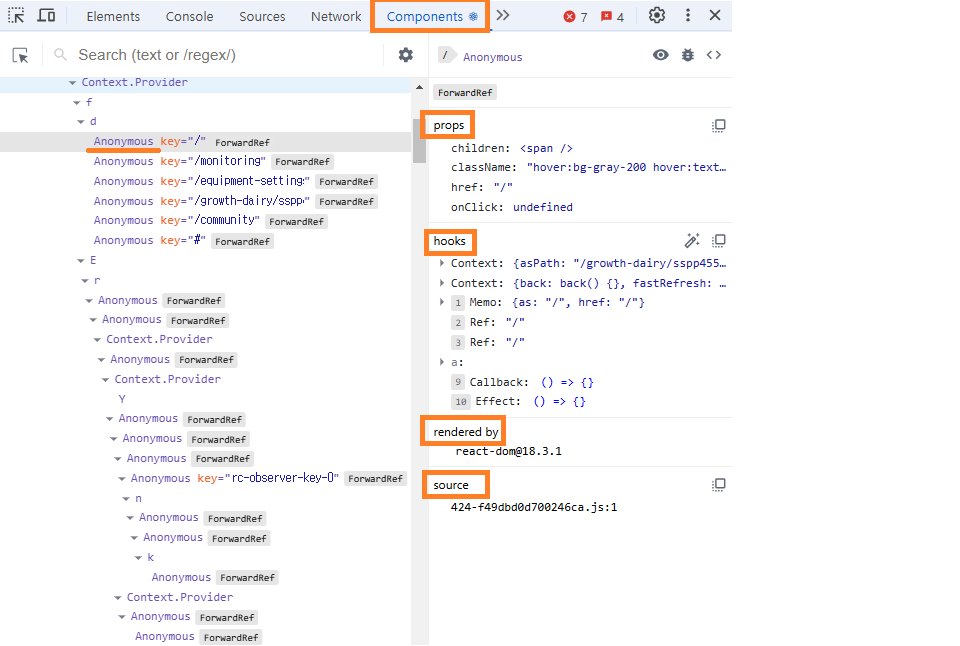

# 6장 리액트 개발 도구로 디버깅하기

[6.1 리액트 개발 도구란?](#61-리액트-개발-도구란)

[6.2 리액트 개발 도구 설치](#62-리액트-개발-도구-설치)

[6.3 리액트 개발 도구 활용하기](#63-리액트-개발-도구-활용하기)

- [6.3.1 컴포넌트](#631-컴포넌트)

- [6.3.2 프로파일러](#632-프로파일러)

[7장 크롬 개발자 도구를 활용한 애플리케이션 분석](#7장-크롬-개발자-도구를-활용한-애플리케이션-분석)

[7.1 크롬 개발자 도구란?](#71-크롬-개발자-도구란)

## 6.1 리액트 개발 도구란?

- 리액트에서 만든 react-dev-tools 를 사용하자

## 6.2 리액트 개발 도구 설치

- 브라우저에서 플러그인 설치 [크롬 react-dev-tools 설치 링크](https://chromewebstore.google.com/detail/react-developer-tools/fmkadmapgofadopljbjfkapdkoienihi?hl=ko&utm_source=ext_sidebar)

## 6.3 리액트 개발 도구 활용하기

### 6.3.1 컴포넌트

- 아래 이미지 처럼 리액트 컴포넌트 트리를 볼 수 있다. (props와 hooks도 볼 수 있음)
- 익명함수 사용시 Anonymous로 나오니 좀더 디버깅을 편하게 하려면 기명식 함수를 사용하자
  

### 6.3.2 프로파일러

- 컴포넌트 메뉴가 정적인 리액트 컴포넌트 트리의 내용을 디버깅하기 위한 도구라면 프로파일러는 리액트가 렌더링하는 과정에서 발생하는 상황을 확인하기 위한 도구다. 여러번 렌더링되는 컴포넌트를 파악하고 일부 컴포넌트의 state가 변경되는데 부모 컴포넌트 부모의 부모 컴포넌트가 렌더링 되는 부분 등 불필요하게 렌더링되는 원인을 찾아 리팩토링하고 성능을 올리도록 하자.
  컴포넌트를 분리하는것 만으로도 많은 렌더링 감소가 된다.

# 7장 크롬 개발자 도구를 활용한 애플리케이션 분석

## 7.1 크롬 개발자 도구란?

# hidden sector

## 1. React vscode에서 디버깅하기

- (1) root 경로에 .vscode/launch.json 파일 생성
- (2) 아래 코드 복사

```
{
  "version": "0.2.0",
  "configurations": [
    {
      "name": "Launch Chrome 3000",
      "request": "launch",
      "type": "chrome",
      "url": "http://localhost:3000",
      "webRoot": "${workspaceFolder}"
    }
  ]
}
```

- (3) vscode에서 원하는 곳에 break point를 설정하고 f5를 눌러 debug를 시작한다.

## 2. Next.js vscode에서 디버깅하기

- (1) root 경로에 .vscode/launch.json 파일 생성
- (2) 아래 코드 복사

```
{
 "version": "0.2.0",
 "configurations": [
   {
     "name": "Next.js: debug server-side",
     "type": "node-terminal",
     "request": "launch",
     "command": "npm run dev"
   },
   {
     "name": "Next.js: debug client-side",
     "type": "chrome",
     "request": "launch",
     "url": "http://localhost:3000"
   },
   {
     "name": "Next.js: debug full stack",
     "type": "node",
     "request": "launch",
     "program": "${workspaceFolder}/node_modules/.bin/next",
     "runtimeArgs": ["--inspect"],
     "skipFiles": ["<node_internals>/**"],
     "serverReadyAction": {
       "action": "debugWithEdge",
       "killOnServerStop": true,
       "pattern": "- Local:.+(https?://.+)",
       "uriFormat": "%s",
       "webRoot": "${workspaceFolder}"
     }
   }
 ]
}
```

- (3) vscode에서 원하는 곳에 break point를 설정하고 f5를 눌러 debug를 시작한다.
